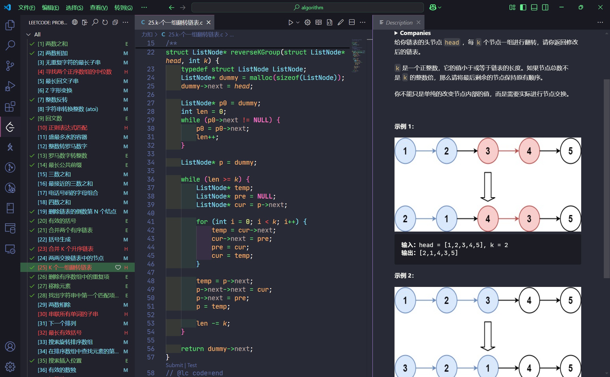

# my-algorithm

本人的一些算法题题解、笔记

**编译环境：** Visual Studio Code + MinGW

***

**参考资料：**

- LetsLearning：[从0开始的C++算法课](https://b23.tv/DgUOlAU)

- 睡不醒的鲤鱼：[LeetCode 每日一题](https://b23.tv/3Bbn70w)

- 代码随想录：[算法公开课](https://b23.tv/IkTSAT8)

- 逊哥带你学编程：[数据结构（C语言描述）](https://b23.tv/gN7lAkC)